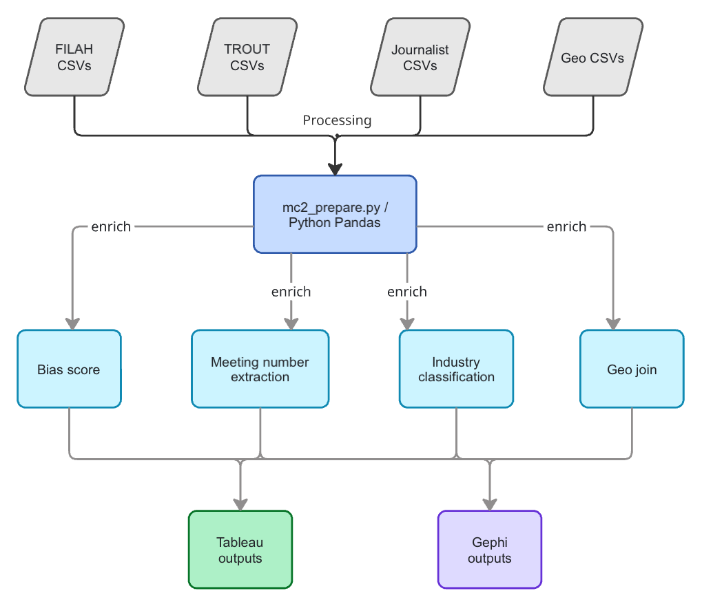

## Overview

The MC2 VAST Challenge 2025 dataset is structured as a **knowledge graph**: nodes represent entities (members, discussions, plans, travel destinations) and links represent relationships (participant, about, part\_of, travel). Raw data arrived as six CSV pairs — one nodes file and one links file per dataset (FILAH, TROUT, Journalist).

The preparation script `mc2_prepare.py` (v3) cleans, enriches, and transforms these into flat tables suitable for Tableau and Gephi. All outputs are written to `./tableau_data/`.

---

## Input Files

| File | Description |
|---|---|
| `mc2_FILAH_nodes.csv` | All nodes recorded by the fishing lobby |
| `mc2_FILAH_links.csv` | All relationships recorded by the fishing lobby |
| `mc2_TROUT_nodes.csv` | All nodes recorded by the tourism lobby |
| `mc2_TROUT_links.csv` | All relationships recorded by the tourism lobby |
| `mc2_jounalist_nodes.csv` | Full journalist record — nodes |
| `mc2_journalist_links.csv` | Full journalist record — links |
| `mc2_geo_nodes.csv` | Geographic place nodes with lat/lon coordinates |
| `mc2_geo_edges.csv` | Geographic connectivity edges |

---

## Topic–Industry Classification

Fifteen discussion topics were manually classified into three industry categories. This lookup table drives all industry-level aggregations.

::: {.key-numbers}
**5 Fishing topics:** Fish Vacuum, Deep Fishing Dock, Low Volume Crane, Seafood Festival, New Crane Lomark

**5 Tourism topics:** Expanding Tourist Wharf, Marine Life Deck, Heritage Walking Tour, Waterfront Market, Concert

**5 Neutral topics:** Affordable Housing, Renaming Park Himark, Name Harbor Area, Name Inspection Office, Statue John Smoth
:::

---

## Key Design Decisions

### Graph Traversal for Topic Assignment

The primary method for assigning industry to a discussion is **graph traversal via `about` links**:

```
discussion/plan → about → topic_node_id → industry
```

String inference from node IDs is used only as a fallback for nodes with no `about` link. This corrects a bug in earlier versions where topic classification relied entirely on substring matching in IDs.

### Meeting Number Extraction

Meeting numbers are extracted from `part_of` links, where `source = Meeting_N` and `target = discussion/plan`. This replaces the earlier regex approach, which was error-prone for edge cases.

### Bias Score Formula

```
Bias_Score = (tourism_participations − fishing_participations) / total_participations
```

- Positive = tourism-leaning
- Negative = fishing-leaning
- Threshold: |score| > 0.15 = directional; within ±0.15 = balanced

---

## Output Files

| File | Rows (approx) | Purpose |
|---|---|---|
| `mc2_nodes_master.csv` | ~3,000 | All nodes, all datasets, enriched |
| `mc2_links_master.csv` | ~5,000 | All edges, all datasets, enriched |
| `mc2_member_sentiment.csv` | ~500 | One row per member × discussion × dataset |
| `mc2_member_activity.csv` | 18 | Bias scores per member per dataset |
| `mc2_member_topic_agg.csv` | ~250 | Member × topic × dataset aggregated |
| `mc2_cross_dataset_comparison.csv` | ~80 | Wide pivot for slope/bump charts |
| `mc2_member_attendance.csv` | 288 | Member × meeting × dataset attendance grid |
| `mc2_travel_geo.csv` | ~120 | Travel plans with lat/lon coordinates |
| `mc2_coverage_comparison.csv` | ~200 | Which discussions appear in which datasets |
| `mc2_industry_breakdown.csv` | 9 | Industry share % per dataset |
| `mc2_gephi_[f/t/j]_nodes.csv` | varies | Bipartite network node files |
| `mc2_gephi_[f/t/j]_edges.csv` | varies | Bipartite network edge files |
| `mc2_topic_industry.csv` | 15 | Topic → industry lookup |

---

## Data Pipeline Diagram



*End-to-end pipeline: raw CSVs → graph traversal → enriched flat tables → Tableau / Gephi*

---

## Bug Fixes (v1 → v3)

| Bug | Symptom | Fix |
|---|---|---|
| BUG A | `mc2_travel_geo.csv` lat/lon always null | Correct join chain: plan → travel link → geo\_node → coordinates |
| BUG B | `mc2_travel_geo.csv` Is\_Member always False | Member found via participant links (source=plan\_id, target=member) |
| BUG C | Non-member orgs leaking into counts | Explicit `MEMBERS` whitelist with assertion guard |
| BUG D | Industry inferred from node ID string | Primary: graph traversal (about link); string inference as fallback only |
| BUG E | NaN Member rows in travel geo | Drop rows where Member is NaN — cross-dataset participant mismatch |
| BUG F | Goldstein missing `deep_fishing_dock` topic | Changed inner join to left merge in cross-dataset comparison |

---

## Running the Script

[Download mc2_prepare.py](mc2_prepare.py){.btn .btn-primary}

```bash
python3 mc2_prepare.py
```

Outputs are written to `./tableau_data/`. The script prints row counts and a summary report on completion.

---

## Gephi Network Files

For Finding 2, bipartite member–topic network graphs were built in Gephi using:

- **Nodes:** 6 COOTEFOO members + 15 topic nodes
- **Edges:** Weighted by participation count; colour-coded by industry
- **Layout:** Fruchterman Reingold

Three separate network graphs were produced — one per dataset (FILAH, TROUT, Journalist) — to make the structural differences in what each lobby chose to record visually apparent.

::: {layout-ncol=3}


:::

*Three Gephi bipartite networks side-by-side: FILAH (left), Journalist (centre), TROUT (right)*
