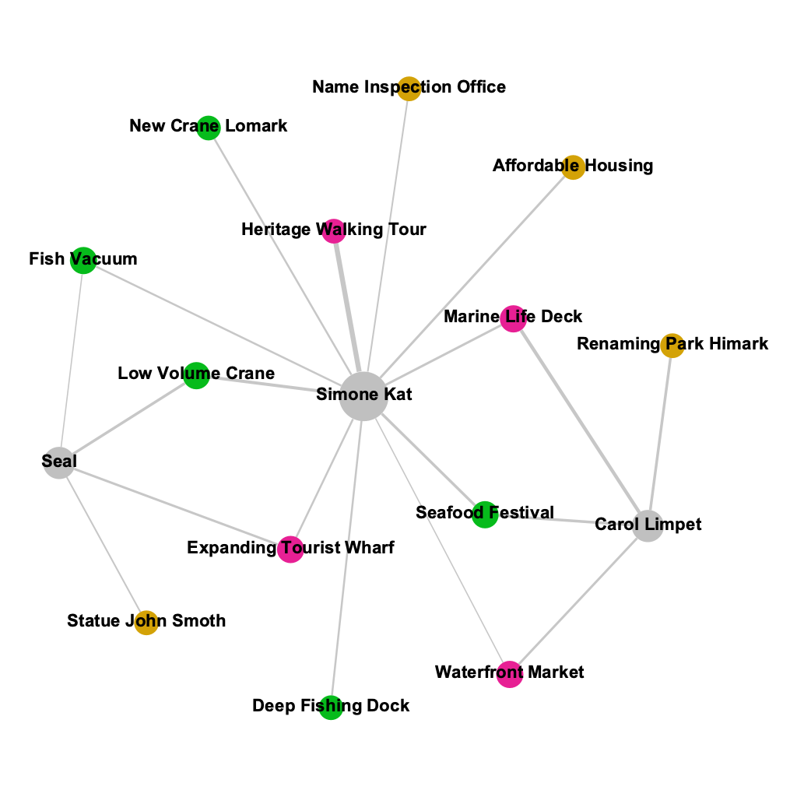
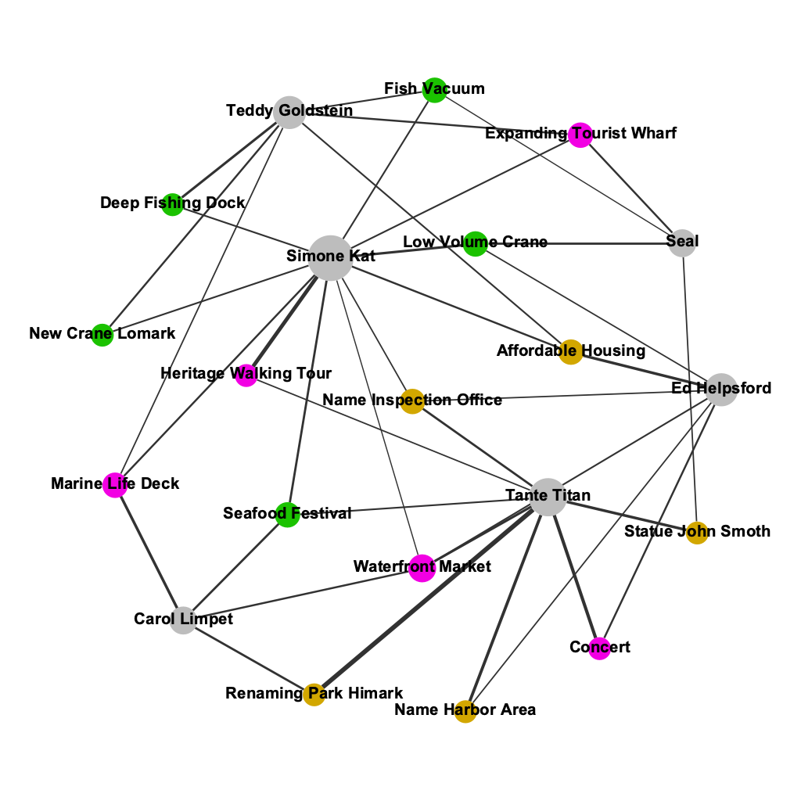
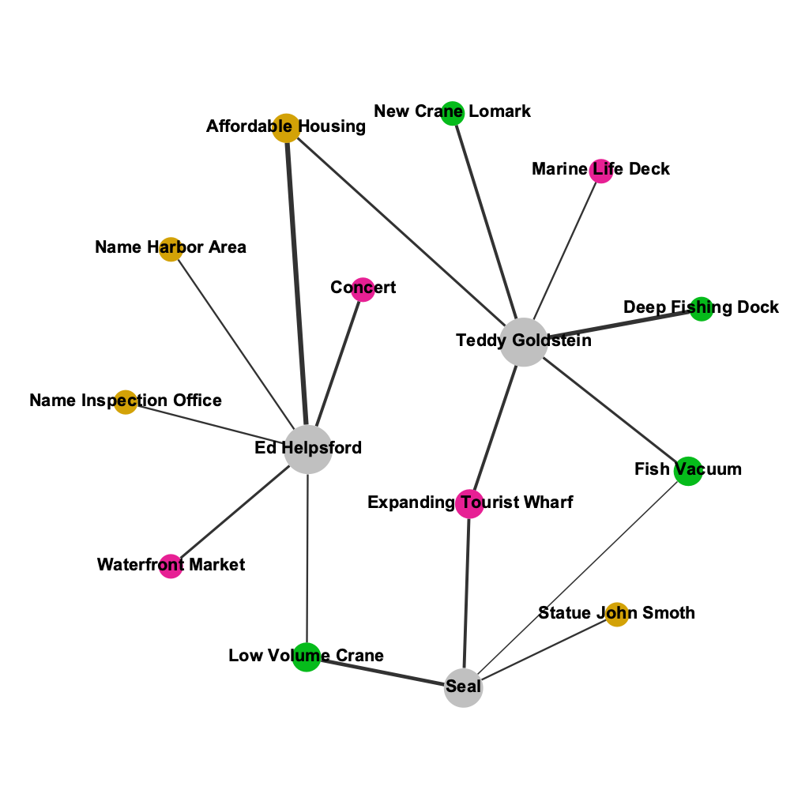

## Summary

Using the journalist's complete record, no member's bias score is statistically extreme. Two members lean toward fishing, three toward tourism, and one is balanced — the committee is not captured by either industry. The confidence intervals confirm that individual deviations are within normal variance.

::: {.key-numbers}
**Bias score range (journalist):** −0.32 (Teddy Goldstein) to +0.29 (Carol Limpet)
**Threshold:** |bias| > 0.15 = directional; within ±0.15 = balanced
**Net committee bias:** near zero — fishing-leaning and tourism-leaning members broadly cancel out
:::

## Dashboard 2 — Committee Balance (Full Record)

### Member Bias Scores — Journalist Dataset

*Diverging lollipop bar — Member Bias Scores using the journalist's full record. Fishing-leaning members extend left (blue); tourism-leaning members extend right (purple). Zero line is the balance point.*

The lollipop chart shows each member's bias score centred on zero. The visual immediately communicates that the committee splits evenly: some members lean fishing, some lean tourism, with no extreme outliers when the full record is used.

### Confidence Intervals

*Confidence interval chart — statistical significance of individual bias scores. Error bars represent the uncertainty around each member's score given their total participation count.*

The confidence intervals confirm that no member's score deviates significantly from zero in a statistically meaningful sense. Members with fewer total participations have wider intervals — their scores are less reliable. This chart prevents the lollipop from being over-interpreted.

### Fishing vs Tourism Participation Quadrant

*Scatter/quadrant chart — each member plotted by fishing participation (x-axis) vs tourism participation (y-axis). Quadrant lines divide fishing-dominant from tourism-dominant regions.*

The scatter quadrant shows the committee's structure: members with high tourism and low fishing participation fall in the upper-left (tourism-dominant) quadrant; members with high fishing and low tourism fall in the lower-right (fishing-dominant) quadrant. No member occupies an extreme corner. This confirms the finding visually without relying on the bias score formula.

### Treemap — Proportional Coverage

*Treemap — each tile represents one member × industry combination. Tile size encodes total participation count; colour encodes industry.*

The treemap makes one fact immediately obvious: **Tante Titan** is the largest tile. She dominates total participation and is tourism-leaning. Her exclusion from both lobby datasets was not accidental — removing her record materially alters the committee's apparent industry balance.

## Dashboard 2.1 — How Selective Reporting Creates a False Narrative

This bridge dashboard shows the same six members through three different lenses: FILAH's version, the journalist's version, and TROUT's version. The finding is structural: member behaviour does not change, only the framing does.

### Side-by-Side Bias Bars — All Three Datasets

*Three bias bar charts side by side — FILAH (left), Journalist (centre), TROUT (right). The same member can look fishing-biased in one and tourism-biased in another.*

This is the most powerful chart in the project. It shows that FILAH's version makes the committee appear tourism-leaning — supporting FILAH's claim that the committee is biased against fishing. TROUT's version makes the committee appear fishing-leaning — supporting TROUT's claim that the committee is biased against tourism. The journalist's version shows a balanced committee that neither lobby's accusation describes.

### Topic Breakdown Stacked Bar — Per Member

*Topic breakdown stacked bar — how each member spends their time across industry topics (journalist record). Bars are sorted by total participation descending.*

### Pro/Against Vote Direction — Per Member

*Pro/Against stacked bar — vote direction (pro, against, neutral) per member. Individual member behaviour is consistent across datasets; only which discussions are included changes.*

## Network Analysis (Gephi)

Bipartite member–topic networks were built in Gephi to visualise the structural differences between datasets. Nodes represent members and topics; edges are weighted by participation count.

*Gephi bipartite network — FILAH dataset. Members (circles) connected to topics (squares). Only fishing-adjacent topics and 3 members present.*

*Gephi bipartite network — Journalist dataset. All 6 members connected to all 15 topics. Balanced structure visible.*

*Gephi bipartite network — TROUT dataset. Only tourism-adjacent topics and 3 members present. Mirror image of FILAH.*

The network graphs make the lobbies' editorial choices structurally visible: each lobby's network is a sparse, industry-skewed subgraph of the journalist's dense, balanced network.

## Key Takeaway

The full committee is balanced. COOTEFOO's six members collectively represent both fishing and tourism interests in near-equal measure. The impression of bias only arises when the record is selectively filtered — as both lobbies did.
