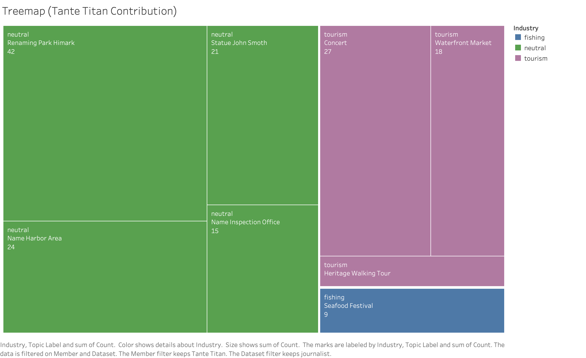

## Summary

The lobbies did not fabricate records. The distortion in their datasets comes entirely from **selective omission** — choosing which members and which discussions to include. The pivotal case is Tante Titan: the committee's most active member, a strong tourism voice, and the one member excluded from both lobby datasets entirely.

::: {.key-numbers}
**Tante Titan's record (journalist):** 54 total participations — fishing: 3, tourism: 17, neutral: 34
**TROUT withheld for Tante Titan:** 54 records across 8 topics
**Effect of her exclusion:** removes the committee's strongest tourism voice — creating an apparent fishing-lean in TROUT's dataset
:::

## Dashboard 4 — Member Overview

This dashboard provides an overview of all six members' profiles and includes an interactive **Person-Picker filter**: clicking any member in the influence bubble filters all other charts on this dashboard to that member's records simultaneously.

### Member Influence Bubble

*Bubble chart — each bubble represents one COOTEFOO member. X-axis: bias score; Y-axis: total participations. Bubble size encodes total records. Colour encodes bias direction.*

The influence bubble provides an overview of all six members' profiles at a glance:

| Member | Bias Direction | Total Participations | Note |
|---|---|---|---|
| Tante Titan | Tourism-leaning | 54 (highest) | Excluded from both lobbies |
| Simone Kat | Fishing-leaning | high | Most polarised fishing voice |
| Teddy Goldstein | Fishing-leaning | medium | Recorded faithfully by TROUT |
| Ed Helpsford | Tourism-leaning | medium | Excluded from FILAH |
| Carol Limpet | Balanced | medium | Excluded from FILAH |
| Seal | Balanced | low | Present in both lobby datasets |

Clicking a member in this chart filters all other charts on the dashboard to that member's records.

### Meeting Attendance Heatmap

*Attendance heatmap — member (rows) × meeting (columns). Green cell = attended; empty cell = absent. Switch datasets using the filter to compare lobby coverage against the journalist record.*

The heatmap shows which members attended which of the 16 committee meetings. Comparing across dataset filters reveals how the lobbies' selective coverage omits attendance records for their excluded members entirely.

### Member Activity Over Time

*Line chart — member participation count across meetings 1–16. Each line represents one member. Tante Titan's consistently high participation is annotated.*

Tante Titan did not just attend more meetings — she was consistently the most active participant across all 16 sessions. Her exclusion removes the single most impactful member from both lobby records.

## Dashboard 4.1 — The Omission Case: FILAH and TROUT

A **Member Filter** on this dashboard allows switching between any COOTEFOO member. The Records FILAH Withheld chart, Records TROUT Withheld chart, and Member Topic Profile treemap all update to reflect the selected member. The Member Impact Bar is fixed and shows the overall committee-level effect of all exclusions combined.

### Member Impact Bar

*Industry share comparison — committee-level industry balance with and without the excluded members. Shows how the lobbies' omissions shift the apparent committee balance.*

Both lobbies excluded members whose records would have undermined their narrative. TROUT excluded Tante Titan — the committee's strongest tourism voice (tourism=17, fishing=3) — causing an apparent fishing-lean in TROUT's dataset. FILAH excluded the three most tourism-leaning members: **Tante Titan**, **Ed Helpsford**, and **Carol Limpet** — causing an apparent fishing-dominated picture. The impact bar quantifies exactly how much the committee's apparent balance shifts when these members are restored.

### Records FILAH Withheld

*Withheld records bar chart — count of records FILAH withheld for the selected member, broken down by topic. Formula: journalist count − FILAH count per topic. Responds to the Member Filter.*

FILAH's exclusions were wholesale — entire members were removed, not individual topics. The withheld records span all industry categories, confirming that FILAH did not selectively filter by topic type. Switching members reveals which individuals were most impacted by FILAH's editorial choices.

### Records TROUT Withheld

*Withheld records bar chart — count of records TROUT withheld for the selected member, broken down by topic. Formula: journalist count − TROUT count per topic. Responds to the Member Filter.*

With Tante Titan selected, TROUT withheld 54 records across 8 topics spanning fishing, tourism, and neutral categories — a total, wholesale exclusion. Switching to other members shows how TROUT's omissions were concentrated on Tante Titan specifically.

### Member Topic Profile — Treemap

*Treemap — selected member's topic participation from the journalist's full record. Tile size encodes participation count per topic; colour encodes industry (fishing = blue, tourism = purple, neutral = green). Always uses the Journalist dataset. Responds to the Member Filter.*

The treemap updates to show whichever member is selected, revealing each member's true topic profile from the complete record. With Tante Titan selected, the largest tiles are tourism-related — showing precisely what both lobbies chose to hide. Switching members allows direct comparison of topic profiles across the full committee.

## Key Takeaway

Neither FILAH nor TROUT fabricated records. Their bias comes from selecting which records to include. The most egregious case is Tante Titan: 54 records, most active member, strongest tourism voice, excluded from both datasets entirely. Restoring her records to either lobby's dataset reverses the apparent bias direction.

**The distortion is structural. The mechanism is omission. The evidence is clear.**
