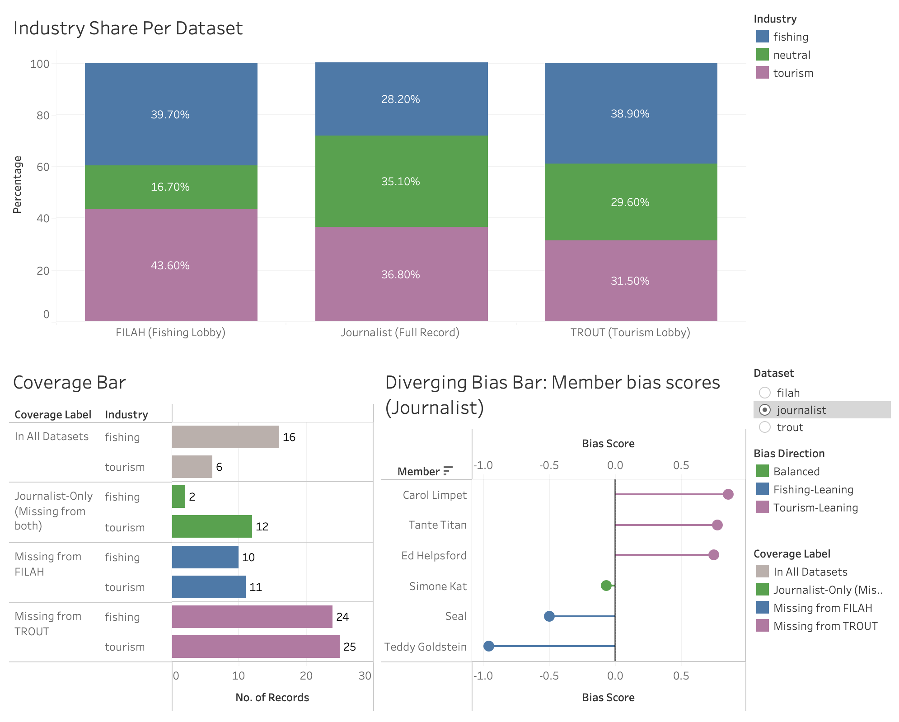

## Project Overview

The Commission on Overseeing the Economic Future of Oceanus (COOTEFOO) sits at the centre of a public controversy. Two advocacy groups — **FILAH** (fishing lobby) and **TROUT** (tourism lobby) — have each released datasets claiming to prove that the committee is biased against their industry. A journalist independently obtained a more complete record of all committee meetings.

This project uses visual analytics to audit all three datasets and determine who, if anyone, is telling the truth.

------------------------------------------------------------------------

## The Three Datasets

::: key-numbers
| Dataset    | Source                    | Records | Share of Full Record |
|------------|---------------------------|---------|----------------------|
| FILAH      | Fishing lobby (advocacy)  | 78      | 45%                  |
| TROUT      | Tourism lobby (advocacy)  | 54      | 31%                  |
| Journalist | Independent (full record) | 174     | 100%                 |
:::

The journalist dataset is the authoritative baseline. FILAH captured 78 of 174 records; TROUT captured only 54.

------------------------------------------------------------------------

## The Four Findings

::: {.callout-note appearance="simple"}
**Finding 1 — Both Datasets Were Curated, Not Collected** FILAH and TROUT each systematically over-represent their preferred industry and exclude discussions that undermine their case.
:::

::: {.callout-note appearance="simple"}
**Finding 2 — The Full Committee Is Balanced** Using the journalist's complete record, no member's bias score is statistically extreme. Two members lean toward fishing, three toward tourism, and one is balanced.
:::

::: {.callout-note appearance="simple"}
**Finding 3 — Sentiment and Travel Show No Systematic Tilt** Meeting sentiment oscillates around neutral across all 16 sessions. Member travel destinations span both fishing and tourism zones.
:::

::: {.callout-note appearance="simple"}
**Finding 4 — The Distortion Comes from Omitted Members, Not Fabricated Data** Tante Titan — the committee's most active member and a strong tourism voice — was excluded from **both** lobby datasets entirely. Restoring her records reverses TROUT's apparent fishing-lean finding.
:::

------------------------------------------------------------------------

## Key Visualisations

{alt="Tableau Schedule" height="auto"}

*Overview dashboard — three datasets tell wildly different stories about the same six-member committee.*

------------------------------------------------------------------------

## Navigation

| Section | What you'll find |
|----|----|
| [Data Transformation](data_transformation.qmd) | How raw knowledge graph CSVs were cleaned and transformed |
| [Finding 1](finding1.qmd) | Dataset coverage bias — selective inclusion by both lobbies |
| [Finding 2](finding2.qmd) | Committee-level bias analysis using the full journalist record |
| [Finding 3](finding3.qmd) | Sentiment over time and member travel patterns |
| [Finding 4](finding4.qmd) | Member deep-dive — Tante Titan exclusion and person-picker |
| [Conclusion](conclusion.qmd) | Answers to all MC2 tasks |
| [Storyboard](storyboard.qmd) | Interactive Tableau application — all 9 dashboards |
| [User Guide](user_guide.qmd) | How to navigate the interactive Tableau application |
| [About](about.qmd) | Team members and project context |

------------------------------------------------------------------------

[View the full project proposal →](proposal.qmd)
