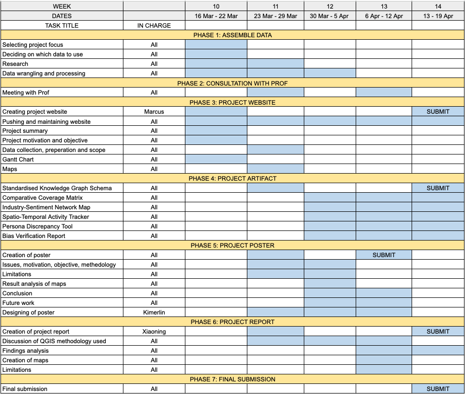

## Project Motivation

The island nation of Oceanus is undergoing a major economic transition from a traditional fishing economy to a rapidly expanding tourism sector. While tourism growth presents new economic opportunities, it has also created tensions among stakeholders who fear unequal policy treatment.

To guide the country's economic future, the government established the Commission on Overseeing the Economic Future of Oceanus (COOTEFOO). Although the commission does not directly set policy, its recommendations carry substantial influence over economic planning and public spending.

Recently, two influential advocacy groups have released conflicting datasets alleging bias in COOTEFOO's decision-making:

> **FILAH** claims that tourism interests are dominating government attention.

> **TROUT** argues that traditional fishing interests are being protected unfairly.

Both groups have published selective datasets to support their claims. However, a journalist has obtained a more complete dataset containing the full set of meetings, travel records, and relationships among stakeholders.

The existence of three competing datasets has created public confusion and reduced trust in government oversight. Citizens cannot easily determine which narrative is accurate.

This project therefore seeks to apply visual analytics and knowledge graph analysis to audit these datasets and determine whether bias exists in the narratives presented by each advocacy group.

------------------------------------------------------------------------

## Project Objectives

**Identifying Data Gaps**\
To what extent do the datasets released by FILAH and TROUT differ from the comprehensive records obtained by the journalist? Which specific meetings, discussions, or travel records were omitted, and how might these omissions influence the narratives presented by each advocacy group?

**Evaluating Individual Behavioral Bias**\
By profiling individual COOTEFOO members, can visual analysis reveal significant differences in perceived behavior when comparing the advocacy datasets to the complete knowledge graph?

**Understanding Institutional Patterns**\
When examining the full dataset, does COOTEFOO as a committee exhibit systematic bias toward either the fishing or tourism sectors?

**How Does Data Framing Influence Public Perception?**\
When users switch between datasets from different advocacy groups, how does the visual narrative change?

------------------------------------------------------------------------

## Scope of Work

The project will involve four main stages of visual analytics development.

### Multi-Source Data Wrangling

Data processing will be conducted using Gephi and Tableau for visualisation. This stage ensures consistency in node identifiers, link relationships, timestamps, and geographic information, enabling reliable comparison across datasets.

Key tasks include: - Cleaning and standardizing node attributes - Aligning node IDs and link IDs across datasets - Identifying duplicate or missing entities - Creating a unified schema for comparative analysis

### Comparative Link Analysis

Once the data is standardized, network visualizations will be created to identify missing or manipulated connections. Key techniques include: - Network graphs showing relationships between COOTEFOO members and stakeholders - Highlighting links that appear in the journalist dataset but are absent in FILAH or TROUT datasets - Filtering tools to isolate specific relationship types (meetings, travel, collaborations)

### Spatiotemporal Behavioral Mapping

Using geographic coordinates and timestamps, the movements and activities of COOTEFOO members will be mapped across time and location. This analysis will highlight clusters of activity associated with fishing or tourism zones, providing insight into real-world behavioral patterns.

Visual techniques will include: - Geographic maps showing travel locations - Timeline charts displaying meeting frequency over time - Cluster analysis identifying concentrated visits to fishing or tourism regions

### Reporting and Visualization Summary

Key findings regarding sampling bias, omitted records, and institutional behavior will be summarized through visual dashboards and a final analytical report.

**Dataset Perspective Toggle**\
Users can switch between: - FILAH dataset - TROUT dataset - Journalist ground truth dataset

**Bias Indicators**\
Metrics such as missing link counts, stakeholder interaction frequency, and sector engagement ratios will provide quantifiable evidence of sampling bias.

**Member Profiles**\
Interactive panels will allow users to select individual COOTEFOO members and view meeting networks, travel patterns, and sector engagement.

------------------------------------------------------------------------

## Expected Outcomes

The final output will consist of:

**An Interactive Tableau Visual Analytics Application**\
Allowing users to explore relationships, travel patterns, and dataset differences.

**Bias Detection Analysis**\
Identification of missing records or selective data presentation by advocacy groups.

**Evidence-Based Findings**\
A clear assessment of whether the accusations made by FILAH or TROUT are supported by the full dataset.

**Final Poster and Analytical Report**\
Summarizing the methodology, visual findings, and implications for government transparency.

------------------------------------------------------------------------

## Significance of the Project

This project demonstrates how visual analytics can support transparency, accountability, and evidence-based decision making. By revealing how data can be selectively presented to support competing narratives, the project highlights the importance of complete datasets and transparent analysis in public policy debates.

For the citizens of Oceanus, the analysis may help restore confidence in the oversight process and clarify the role of COOTEFOO in guiding the nation's economic transition.

## Project Schedule

