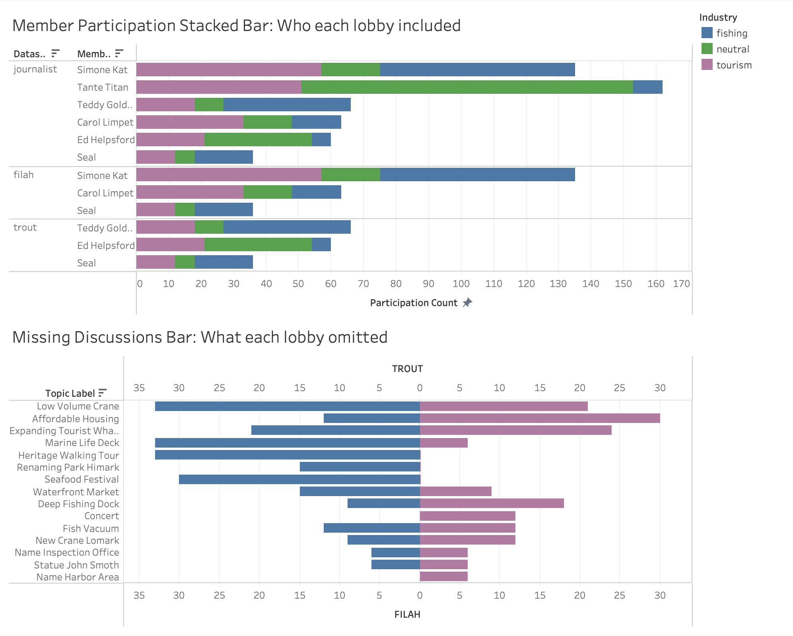
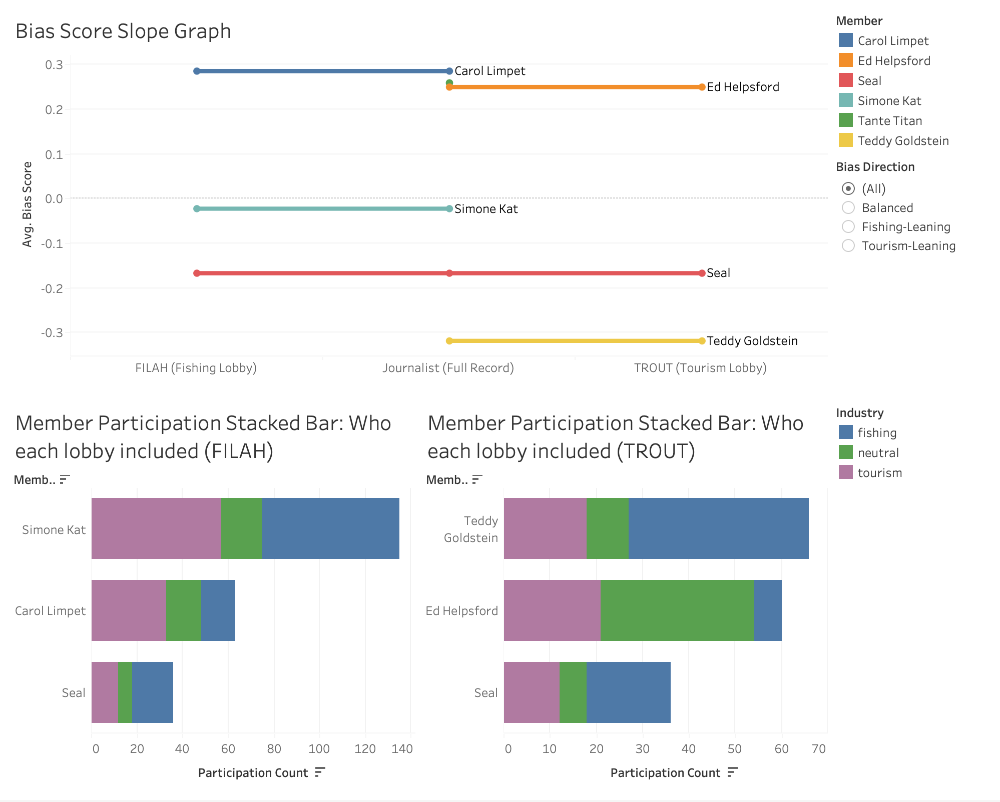
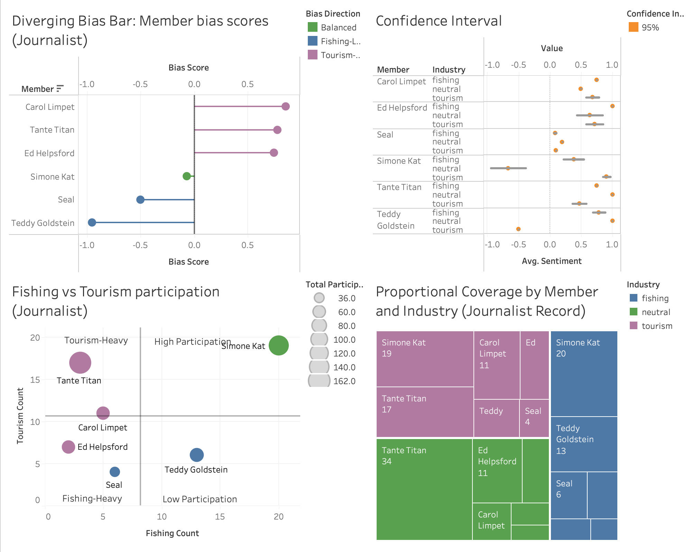
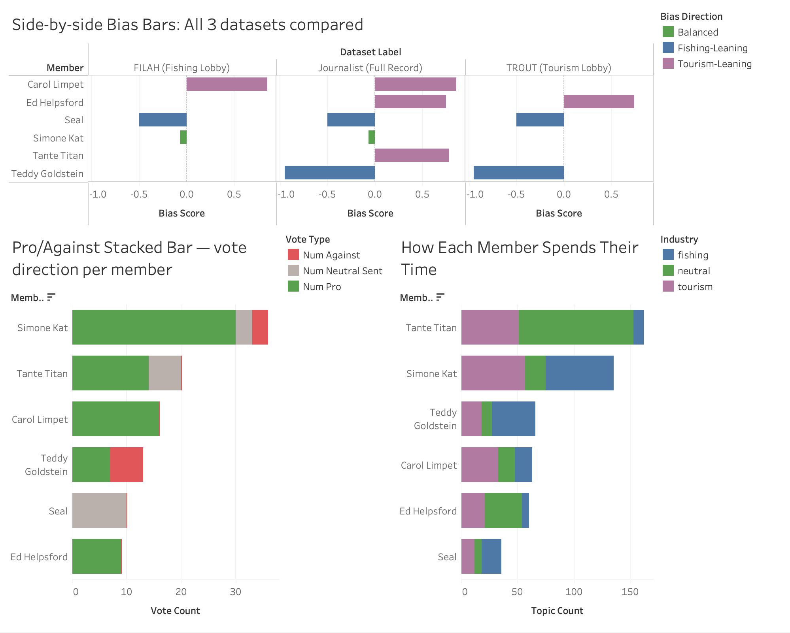
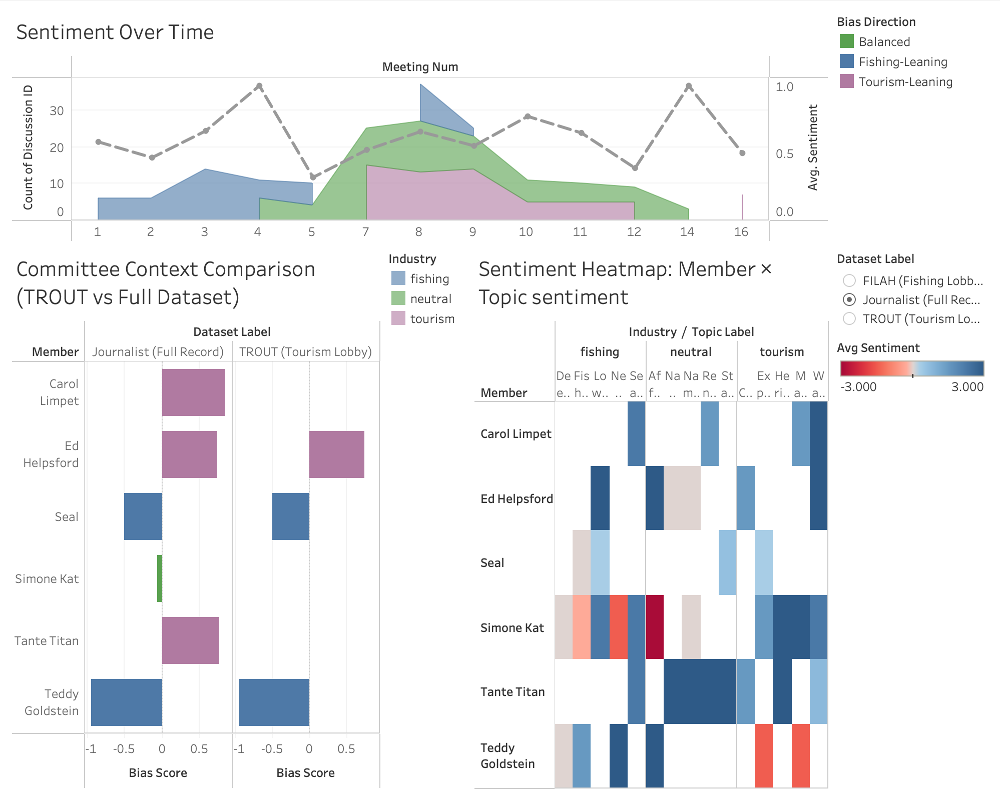
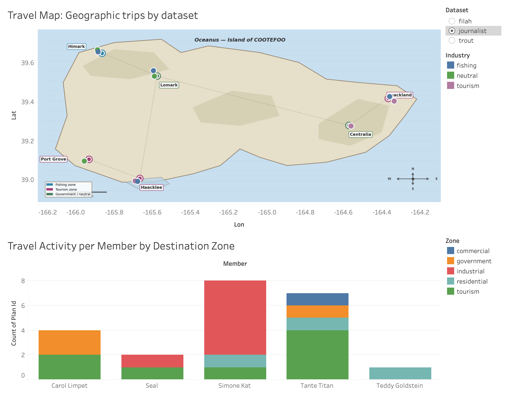
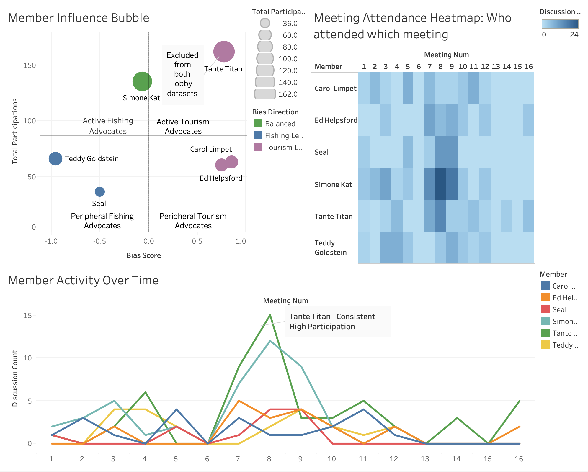
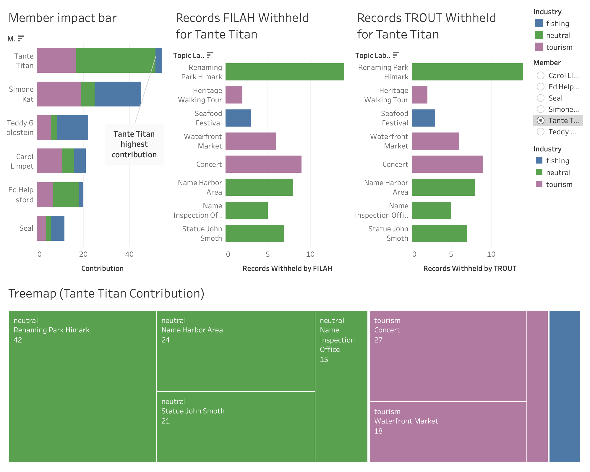

## Overview

This guide provides step-by-step instructions for navigating the interactive Tableau storyboard. The application consists of 9 dashboards, each communicating one finding. This guide covers the controls and interactive features available on each dashboard.

To view the storyboard, visit the [Final Storyboard](storyboard.qmd) page.

---

## Navigating the Storyboard

This dashboard serves as the entry point to the application, providing an overview of all three datasets and orienting the viewer before the four findings are presented.

1) **Story Point Navigation** — Users can move between the 9 dashboards using the navigation controls at the top of the storyboard.

    a. Users can click the **left/right arrow** buttons to move to the previous or next dashboard sequentially.
    b. Users can click any **numbered tab** directly to jump to a specific dashboard.

---

## Dashboard 0 — Overview: Detecting Bias in COOTEFOO

This dashboard serves as the entry point to the application. It presents all three datasets side by side — FILAH, TROUT, and the Journalist — so that the viewer can immediately see how differently the same committee is represented depending on which dataset is read.

1) **Industry Share Per Dataset** (top) — Displays the proportion of fishing, tourism, and neutral discussions recorded by each of the three datasets.

    a. Users can hover over any bar segment to see the exact count and percentage for that industry category.
    b. The three bars (FILAH, TROUT, Journalist) are always shown together — no filter is applied to this chart.

2) **Record Count Per Dataset** (bottom left) — Displays the total number of discussion records in each dataset.

    a. Users can hover over a bar to see the exact record count.

3) **Diverging Bias Bar: Member Bias Scores** (bottom right) — Displays each member's bias score from the Journalist dataset. Members extending left are fishing-leaning (blue); members extending right are tourism-leaning (purple).

    a. Users can hover over any lollipop to see the member's name, exact bias score, and bias direction label.

4) **Dataset Label Filter** — Users can select a dataset using the filter panel to change which dataset is reflected in the bias bar.

    a. Users can select `FILAH (Fishing Lobby)`, `TROUT (Tourism Lobby)`, or `Journalist (Full Record)`.
    b. Changing the filter updates the bias bar chart to reflect that dataset's member scores.

---

## Dashboard 1 — Finding 1: What Each Lobby Left Out

This dashboard shows that the lobbies' omissions are not accidental — they systematically excluded the topics and members most damaging to their case.

1) **Member Participation Stacked Bar** (top) — Shows the total number of discussions each member participated in, broken down by industry (fishing / tourism / neutral), for all three datasets side by side.

    a. Users can use the **Dataset Label filter** to switch between the FILAH, TROUT, and Journalist views.
    b. Members excluded from the selected dataset will not appear in the chart.
    c. Users can hover over a bar segment to see the member's name, industry category, and participation count.

2) **Missing Discussions Bar** (bottom) — Shows which topics each lobby omitted entirely from their dataset.

    a. Users can use the **Dataset Label filter** to switch between viewing FILAH's omissions and TROUT's omissions.
    b. Users can hover over a bar to see the topic name, industry category, and number of records omitted.
    c. Topics are sorted by number of omitted records descending.

---

## Dashboard 1.1 — Finding 1 (Continued): How Exclusions Distort the Rankings

This dashboard shows the structural consequence of the lobbies' member exclusions: the same six committee members produce entirely different rankings depending on which lobby's dataset you read.

1) **Slope Graph** — Shows how each member's participation ranking shifts from the FILAH dataset (left) to the TROUT dataset (right), with the Journalist record as the centre baseline.

    a. Members excluded from a lobby dataset have a **broken line** — the line ends at the last dataset that includes them.
    b. Users can hover over any point to see the member's name, dataset, and rank.
    c. Lines that cross each other indicate rank reversals caused by selective inclusion.

2) **Member Participation — FILAH vs TROUT** — Places the FILAH-only and TROUT-only participation bars side by side for direct comparison.

    a. Users can use the **Dataset Label filter** to toggle between the two lobby views, or view them together if the combined chart is used.
    b. Users can hover over a bar segment to see the member's name, industry category, and participation count.
    c. The near-complete absence of overlap between the two lobbies' recorded members is immediately visible.

---

## Dashboard 2 — Finding 2: The Full Committee Is Balanced

This dashboard uses the journalist's complete record to assess whether the COOTEFOO committee is genuinely biased. Four complementary charts are used to triangulate the finding.

1) **Diverging Bias Bar: Member Bias Scores** (top left) — Shows each member's bias score using the journalist dataset. The zero line is the balance point.

    a. Users can hover over any lollipop to see the member's name, bias score, and direction label.
    b. The chart is fixed to the Journalist dataset — it always reflects the full record.

2) **Confidence Interval Chart** (top right) — Shows the statistical uncertainty around each member's bias score.

    a. Users can hover over any error bar to see the member's bias score, confidence interval bounds, and total participation count.
    b. Members with fewer participations have wider intervals — their scores are less reliable.

3) **Fishing vs Tourism Participation Quadrant** (bottom left) — Plots each member by fishing participation (x-axis) vs tourism participation (y-axis).

    a. Users can hover over any point to see the member's name and exact fishing/tourism counts.
    b. The quadrant dividers show the average fishing and tourism participation levels — points in the upper-left lean fishing; lower-right lean tourism.

4) **Treemap** (bottom right) — Shows proportional coverage by member and industry. Tile size encodes total participation count.

    a. Users can hover over a tile to see the member name, industry category, and record count.
    b. The largest tile (Tante Titan) is immediately visible — her dominance of the full record is the basis for Finding 4.

---

## Dashboard 2.1 — Bridge: How Selective Reporting Creates a False Narrative

This dashboard places all three datasets side by side so that the mechanism of bias distortion is visible at a glance. The same six members appear with different bias scores depending solely on which dataset is used.

1) **Side-by-Side Bias Bars: All Three Datasets** (top) — Displays the member bias scores from FILAH, Journalist, and TROUT in three adjacent panels.

    a. All three datasets are shown simultaneously — the dataset filter is not used on this dashboard.
    b. Users can hover over any lollipop to see the member's name, dataset, and bias score.
    c. The same member can be compared across all three panels by reading horizontally.

2) **Topic Breakdown Stacked Bar** (bottom left) — Shows how each member distributes their participation across industry topics using the journalist record.

    a. Users can hover over any segment to see the member, topic, and count.
    b. Bars are sorted by total participation descending.

3) **Pro/Against Stacked Bar** (bottom right) — Shows each member's vote direction (pro, against, neutral) across discussions.

    a. Users can hover over any segment to see the member, sentiment label, and count.

---

## Dashboard 3 — Finding 3: Sentiment

This dashboard examines whether meeting sentiment shows any persistent directional bias across the 16 committee sessions.

1) **Sentiment Over Time** (top, full width) — Shows meeting-level sentiment across all 16 sessions as a stacked area chart with a trend line overlay.

    a. Users can hover over any point on the trend line to see the meeting number and average sentiment score.
    b. The gap between Meeting 5 and Meeting 7 reflects a session that was not held — this is a structural calendar feature, not a data gap.
    c. Users can use the **Dataset Label filter** to compare sentiment patterns across the three datasets.

2) **Committee Context Comparison** (bottom left) — Compares TROUT's apparent committee-level industry balance with the journalist's full record.

    a. Users can hover over bars to see the dataset, industry category, and count.

3) **Sentiment Heatmap: Member × Topic** (bottom right) — Displays average sentiment for each member × topic combination as a colour-coded grid.

    a. Users can hover over any cell to see the member name, topic, average sentiment score, and sentiment label.
    b. Green cells = pro; red cells = against; grey cells = neutral or not rated.
    c. Users can use the **Dataset Label filter** to compare sentiment grids across datasets.

---

## Dashboard 3.1 — Finding 3 (Continued): Travel

This dashboard examines whether member travel destinations show any geographic concentration in fishing or tourism zones that could indicate behavioural bias.

1) **Travel Map** (main) — Shows COOTEFOO member travel destinations on a map of Oceanus. Markers are colour-coded by industry zone.

    a. Users can hover over any marker to open a **tooltip heatmap** showing city-level visit breakdowns by member.
    b. Users can zoom in and out using scroll, and reset the map view by double-clicking.
    c. Users can use the **Dataset Label filter** to view only the travel records captured by a specific dataset.

2) **Travel Activity Breakdown** (supporting) — Shows total travel activity per member broken down by destination zone (fishing / tourism / neutral).

    a. Users can hover over any bar segment to see the member name, destination zone, and trip count.
    b. Bars are sorted by total trip count descending.
    c. Users can use the **Dataset Label filter** to compare travel patterns across the three datasets.

---

## Dashboard 4 — Finding 4: Member Overview

This dashboard provides an overview of all six members' profiles. Clicking any member in the Influence Bubble activates the **Person-Picker filter**, updating all other charts on this dashboard to that member's records.

1) **Member Influence Bubble** (top left) — Plots each member by bias score (x-axis) and total participations (y-axis). Bubble size encodes total record count.

    a. Users can **click on any bubble** to activate the Person-Picker filter — all other charts on this dashboard will update to show only that member's records.
    b. Users can click the same bubble again (or press **Esc**) to clear the filter and return to the full committee view.
    c. Users can hover over any bubble to see the member's name, bias score, bias direction, and total participations.

2) **Meeting Attendance Heatmap** (top right) — Shows which members attended which of the 16 meetings. Green cells = attended; blank cells = absent.

    a. Users can hover over any cell to see the member name, meeting number, and discussion count for that session.
    b. When the Person-Picker is active, only the selected member's row is highlighted.
    c. Users can use the **Dataset Label filter** to compare attendance records across the three datasets.

3) **Member Activity Over Time** (bottom) — Shows each member's participation count across all 16 meetings as a line chart.

    a. Users can hover over any point to see the member, meeting number, and discussion count.
    b. When the Person-Picker is active, the selected member's line is highlighted.

---

## Dashboard 4.1 — Finding 4 (Continued): The Omission Case

This dashboard presents the full evidence for the lobbies' selective member exclusions. A **Member Filter** lets users switch between members — the two withheld-record charts and the topic profile treemap all update to reflect the selected member. Tante Titan is selected by default as the pivotal case.

1) **Member Impact Bar** (top left) — Compares the committee's apparent industry balance with and without the excluded members. Quantifies how far the lobbies' omissions shift the committee's apparent balance.

    a. Users can hover over the bars to see the exact industry share percentages with and without the excluded members.
    b. This chart covers all excluded members collectively and does not respond to the Member Filter.

2) **Member Filter** — Users can select any COOTEFOO member using the filter to explore that member's withheld records and topic profile.

    a. Changing the selected member updates the Records FILAH Withheld chart, the Records TROUT Withheld chart, and the Member Topic Profile treemap simultaneously.
    b. Members who were not excluded by a lobby will show zero withheld records in that lobby's chart.

3) **Records FILAH Withheld** (top middle) — Shows the per-topic count of records that FILAH omitted for the selected member. Formula: Journalist count − FILAH count per topic.

    a. Users can hover over any bar to see the topic name, industry category, and number of withheld records.
    b. Responds to the Member Filter — switching members updates this chart.
    c. Bars are sorted by number of withheld records descending.

4) **Records TROUT Withheld** (top right) — Shows the per-topic count of records that TROUT omitted for the selected member. Formula: Journalist count − TROUT count per topic.

    a. Users can hover over any bar to see the topic name, industry category, and number of withheld records.
    b. Responds to the Member Filter — switching members updates this chart.
    c. Members not excluded by TROUT will show zero withheld records.

5) **Member Topic Profile — Treemap** (bottom, full width) — Shows the selected member's full topic participation from the journalist record. Tile size encodes participation count; colour encodes industry (fishing = blue, tourism = purple, neutral = green).

    a. Responds to the Member Filter — switching members updates the treemap to reflect that member's journalist record.
    b. This chart always uses the Journalist dataset — it does not respond to the Dataset Label filter.
    c. Users can hover over any tile to see the topic name, industry category, and participation count.
